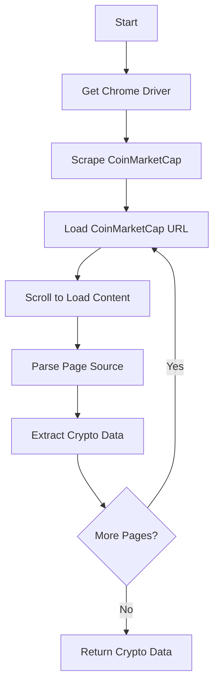

```mermaid
%%{init: {'theme': 'base', 'themeVariables': {
  'primaryColor': '#E8F0FE',
  'primaryTextColor': '#000000',
  'primaryBorderColor': '#B6C7E2',
  'lineColor': '#8FAADC',
  'secondaryColor': '#F3F7FD',
  'tertiaryColor': '#FFFFFF'
}}%%
flowchart TD
    A[Start] --> B[Get Chrome Driver]
    B --> C[Scrape CoinMarketCap]
    C --> D[Load CoinMarketCap URL]
    D --> E[Scroll to Load Content]
    E --> F[Parse Page Source]
    F --> G[Extract Crypto Data]
    G --> H{More Pages?}
    H -->|Yes| D
    H -->|No| I[Return Crypto Data]
```
