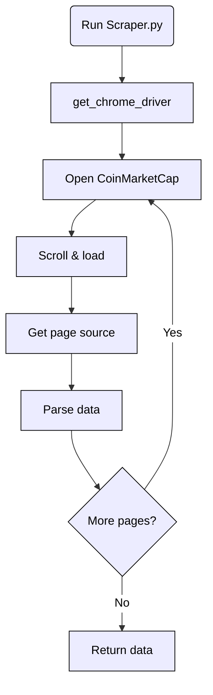

```mermaid
%%{init: {'themeVariables': { 'background': '#ffffff', 'primaryColor': '#f9f9f9', 'edgeLabelBackground':'#ffffff', 'nodeBorder':'#000000', 'textColor':'#000000'}}}%%

flowchart TD
    A(Run Scraper.py) --> B[get_chrome_driver]
    B --> C[Open CoinMarketCap]
    C --> D[Scroll & load]
    D --> E[Get page source]
    E --> F[Parse data]
    F --> G{More pages?}
    G -->|Yes| C
    G -->|No| H[Return data]
```
